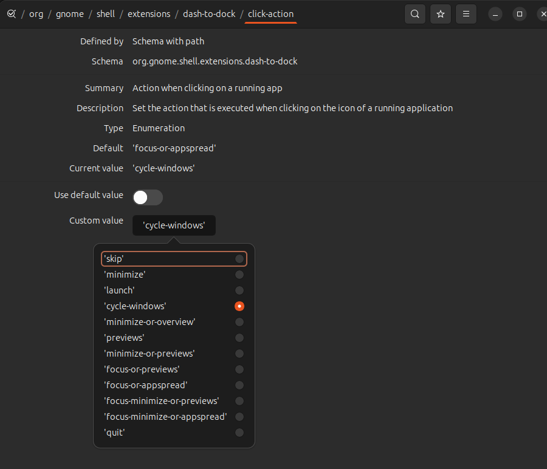

# New system installation notes.

Some general notes and instructions on bootstrapping a new linux installation.

```
# add latest upstream git ppa.
sudo add-apt-repository ppa:git-core/ppa

sudo apt update && sudo apt upgrade
sudo apt install git curl build-essential cmake
```

# git delta

git is configured using this tool.

https://github.com/dandavison/delta/releases
sudo dpkg -i git-delta_0.16.5_amd64.deb

## taplo toml formatter

```bash
cargo install taplo-cli --locked
  | gzip -d - | install -m 755 /dev/stdin /usr/local/bin/taplo
```

## github cli

convenient for authenticating with github.

https://github.com/cli/cli/blob/trunk/docs/install_linux.md


### authenticate your workstation with github.

```
gh auth login
```

## ghostty
https://github.com/mkasberg/ghostty-ubuntu?tab=readme-ov-file

## kanata

download binary: https://github.com/jtroo/kanata/releases

create a service (`kanata.service`) inside your `~/.config/systemd/user` folder:
(make it point to the right executable.)


```
[Unit]
Description=Kanata keyboard remapper
Documentation=https://github.com/jtroo/kanata

[Service]
Environment=PATH=/usr/local/bin:/usr/local/sbin:/usr/bin:/bin:%h/.cargo/bin

#   Uncomment the 4 lines beneath this to increase process priority
#   of Kanata in case you encounter lagginess when resource constrained.
#   WARNING: doing so will require the service to run as an elevated user such as root.
#   Implementing least privilege access is an exercise left to the reader.
#
# CPUSchedulingPolicy=rr
# CPUSchedulingPriority=99
# IOSchedulingClass=realtime
# Nice=-20
Type=simple
ExecStart=/usr/bin/sh -c 'exec $$(which kanata) --cfg $${HOME}/.config/kanata/config.kbd'
Restart=no

[Install]
WantedBy=default.target
```

```
systemctl --user daemon-reload
systemctl --user enable kanata.service
```

to restart:
```
systemctl --user restart kanata.service
```

## import your dotfiles

```
mkdir ~/repos
cd repos
git clone https://github.com/sander76/dotfiles.git
cd dotfiles
./setup.sh

```


## fira nerd font

https://www.nerdfonts.com/

copy FiraCode folder to ~/.local/share/fonts. (~/.local/share/fonts/FiraCode/<all ttf files here>)


## zshell

IMPORTANT: log out and log in again. Otherwise it will not work.

- sudo apt install zsh

- clone autosuggestions: https://github.com/zsh-users/zsh-autosuggestions/blob/master/INSTALL.md


## starship shell

```
curl -sS https://starship.rs/install.sh | sh
```

## pcloud drive


## pyenv

https://github.com/pyenv/pyenv-installer?tab=readme-ov-file#installation--update--uninstallation
https://github.com/pyenv/pyenv#set-up-your-shell-environment-for-pyenv


## vscode

download `.deb` package

```
sudo dpkg -i vscode
```

## ulauncher, 

> not using this anymore.

https://ulauncher.io/#Download

- make CTRL-CTRL the hotkey
- add opener to plugin: https://github.com/sander76/ulauncher-opener
- add CTRL-SPACE to system wide shortcut (wayland and ulauncher don't play nice together)

## zellij


make sure cargo is installed.

compile zellij using `cargo`: https://zellij.dev/documentation/installation


## tldr 


https://github.com/pepa65/tldr-bash-client#installation

(First run can take a while due to caching.)

## fzf
https://github.com/junegunn/fzf#using-git


## pipx

- download pipx zipfile (.pyx) and copy to `~/bin/` (https://pipx.pypa.io/stable/#using-pipx-without-installing-via-zipapp)
- the alias is already defined. So you should be able to run `pipx` now directly from you terminal.

## ripgrep

```
sudo apt install ripgrep
```

## flatpak

```
sudo apt install flatpak
```

add flathub repository.

https://flathub.org/setup/Ubuntu

## snapshot/annotation tool

```
sudo apt install ksnip
```

By default ksnip does not add itself to the 'open with' list when viewing an image.
To enable this:

- open the `/usr/share/applications/org.ksnip.ksnip.desktop` file
- In the `[Desktop Entry]` append ` %F` to the `Exec=ksnip` line.

screenshot tool


## beekeeper

## Rust
install rustup, https://rustup.rs/

## Freecad

## Prusa slicer

## Superslicer

An alternative to prusa slicer.

## Docker

Install docker engine: https://docs.docker.com/engine/install/ubuntu/#install-using-the-repository

to run docker without sudo:

```
sudo groupadd docker
newgrp docker
sudo usermod -aG docker $USER
```

## Disable bell sound in shell

uncomment or add `set bell-style none` in the `/etc/inputrc` file.

## vscode

debug configuration:

```
{
  "name": "Python: Debug Tests",
  "type": "debugpy",
  "request": "launch",
  "program": "${file}",
  "purpose": ["debug-test"],
  "console": "integratedTerminal",
  "justMyCode": false
}
```


## gsettings, changing docking hotkeys.

normally <super>1 to 3 will launch application 1 to 3 as they appear on the dock.
These settings remap those to other keys.

for schema definitions: /usr/share/glib-2.0/schemas
ui as a help: dconf-editor

```shell
gsettings set org.gnome.shell.extensions.dash-to-dock app-hotkey-1 "['<Super>r']"  # terminal
gsettings set org.gnome.shell.extensions.dash-to-dock app-hotkey-2 "['<Super>f']"  # firefox
gsettings set org.gnome.shell.extensions.dash-to-dock app-hotkey-3 "['<Super>c']"  # vs code
gsettings set org.gnome.shell.extensions.dash-to-dock app-hotkey-4 "['<Super>t']"  # teams
gsettings set org.gnome.shell.extensions.dash-to-dock click-action "cycle-windows"
gsettings set org.gnome.shell.extensions.dash-to-dock hotkeys-show-dock "false"

# disable toggle-quick-settings:
gsettings set org.gnome.shell.keybindings toggle-quick-settings '["disabled"]'

```

## disable capslock

install gnome-tweaks

<keyboard><Additional Layout Options>

Find the disable caps-lock.

## run or raise

[not using anymore ?]

> trying to replace this with tweaking the gsettings (see below.)

possible alternative:
use dconf editor and change this setting:



activate a currently running application using shortcut or start the application.

A gnome shell plugin: https://extensions.gnome.org/extension/1336/run-or-raise/

check `~/.config/run-or-raise/shortcuts.conf` for current shortcuts.


## libsecret

Set secrets as env variables using the keyring.

`apt install libsecret-tools`

store a secret:

`secret-tool store --label='my token' token mistral-codestral`  
in human language: "give me the token value of mistral-codestral"
>> enter a password

get a secret:
`secret-tool lookup token mistral-codestral`
>> token will be returned.
